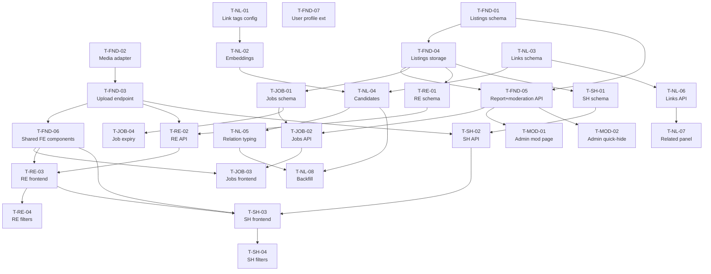

# DiaryNews Expansion Plan

> **Execution note:** When this plan is approved, the first action is to create `docs/expansion-plan.md` with the contents of this file. The plan-mode-only restriction is the reason it lives here first.

---

## Context

DiaryNews today is a single-purpose reader: Portuguese RSS → scrape → LLM summarize + Chinese translate + classify → SQLite → React SPA for the Chinese expat community in Portugal. The recent `Auth-01` branch (`a4eff81`) added Google OAuth + JWT + 3-tier access (public / logged-in / admin).

The user wants to evolve DiaryNews from a reader into a **community platform**:

1. Enrich the news experience with **relational context** — temporal follow-ups, causal chains, and entity overlap, so readers see the bigger picture rather than isolated articles.
2. Add three posting modules — **Jobs**, **Real Estate (sale/rent)**, **Second-Hand marketplace** — where logged-in users publish classifieds for the same community.

Outcome: a single platform covering the end-to-end Chinese expat daily life — news, jobs, housing, goods — built on the existing FastAPI + React + SQLite spine, reusing the storage, auth, and enrichment patterns that are already in place.

---

## 1. Executive Summary

- **Framework:** Stay with FastAPI + React + SQLite. Django would require rewriting ~90% of existing code for zero user-facing gain.
- **Auth:** Already built (Auth-01). Extend only for: ownership checks, user-submitted reports, and admin moderation actions.
- **Image storage:** Local filesystem now, behind a `MediaStorage` adapter interface. One-line env switch to S3/R2 later.
- **Moderation:** Post-publish. Listings go live immediately; report button for users; admin can hide/remove; per-listing status field tracks lifecycle.
- **Contact:** External only. Posters provide phone / WhatsApp / email fields. No in-app messaging (kept as a future phase).
- **News linking:** Tag-gated hybrid. Only articles whose `tags_zh` intersect a configurable subset (default: `移民签证, 法律法规, 中葡关系`) enter the linking pipeline. Within that subset: embeddings for candidate retrieval → LLM for relation typing (`follow_up` / `cause_effect` / `shared_entity`) → batch after each fetch.
- **Shared substrate:** One `listings` table + per-kind extension tables. Reuses upload, ownership, status, and report plumbing across Jobs / RealEstate / SecondHand.
- **Rollout:** Phase 0 (shared foundations) → Phase 1 Jobs (simplest, no images, validates end-to-end) → Phase 2 Real Estate (introduces image carousel) → Phase 3 Second-Hand (thin layer on top) → Phase 4 News Linking (runs in parallel) → Phase 5 Moderation UI.

---

## 2. Architecture Decisions

### 2.1 Framework: FastAPI (stay)
**Decision:** Keep FastAPI.
**Tradeoffs:**
- **Pro:** Already installed, Auth-01 already wired, the thin `api.py → services.py → storage/<domain>.py` split is idiomatic FastAPI and working well.
- **Pro:** Pydantic models already in use; adding new resources is purely additive.
- **Con vs Django:** No built-in admin panel. This costs ~1 task in Phase 5 (simple admin listing page) — worth it to avoid rewriting the existing codebase.

### 2.2 Database: SQLite (stay) with a Postgres escape hatch
**Decision:** Stay on SQLite + WAL. Keep the storage layer as the seam that would make Postgres migration straightforward.
**Tradeoffs:**
- **Pro:** Portuguese-Chinese community is ~30k people; even with aggressive adoption the platform will generate thousands, not millions, of listings. WAL-mode SQLite handles this.
- **Pro:** Existing patterns (`INSERT OR REPLACE`, manual `ALTER TABLE` migrations in `database.py`) work identically for new tables.
- **Risk:** A viral listing + heavy concurrent writes could cause contention. Mitigate by keeping all write paths in `backend/services.py` where we can serialize if needed.
- **Future:** When migration becomes necessary, the storage layer abstraction lets us swap the DB driver without touching endpoints.

### 2.3 Auth: extend the existing JWT + Google flow
**Decision:** No new auth mechanism. Reuse `backend/auth.py`.
**Added:**
- **Ownership guard** — a new `require_listing_owner_or_admin(listing_id)` dependency in `auth.py`.
- **Report endpoint** — logged-in users can report any listing (writes to `listing_reports`).
- **Admin moderation** — hide/remove endpoints already reuse the existing `require_admin` guard.
- **User profile extension** — add optional `phone` column to `users` for posters who want to pre-fill contact info.

### 2.4 Image & File Storage: local-now with adapter
**Decision:** Build a `MediaStorage` interface with two implementations (`LocalMediaStorage`, `S3MediaStorage`), selected via `MEDIA_BACKEND` env var. Default = local.
**Tradeoffs:**
- **Pro:** Ship simple (single VM, `/data/uploads/`). Swap to S3/R2 with one env var change when needed.
- **Pro:** Upload endpoint contract (`POST /api/media/upload → {storage_key, thumb_key, url, thumb_url}`) is identical for both backends.
- **Con:** Local storage is lost on server rebuild — document backup procedure early.
- **Thumbnail generation:** Pillow, 400px longest side, JPEG quality 85. Generated synchronously at upload time; 5 MB upload limit.

### 2.5 News Linking: tag-gated hybrid, batch
**Decision:** A three-stage filter — tag gate → embeddings candidate retrieval → LLM relation typing.

**Stage 1 — Eligibility filter (zero added cost):**
- `sources.py` defines `LINKABLE_TAGS = {"移民签证", "法律法规", "中葡关系"}` (user-configurable).
- An article is linkable iff its existing `tags_zh` (already classified by the translation LLM call) intersects this set.
- Non-linkable articles are ignored entirely by the linking pipeline.

**Stage 2 — Embedding retrieval (one embedding per linkable article):**
- Add `call_minimax_embed(text)` to `llm.py`, mirroring `call_minimax`.
- Piggyback on the enrichment step in `news._enrich_article`: if the article is linkable, generate one embedding from `title_zh + content_zh[:2000]` and store it in `news_embeddings`.
- For each newly-linkable article, find top-K=10 nearest neighbors among existing linkable embeddings via in-memory cosine (fine for <10k vectors).

**Stage 3 — LLM relation typing (batched):**
- After the fetch cycle completes, for each new article × top-K candidate pairs above a similarity threshold (e.g. 0.75), call the LLM once to classify the relation as `follow_up` / `cause_effect` / `shared_entity` / `unrelated` with a confidence score.
- Restrict pair candidates to a `±60-day` window — two immigration articles from 2024 and 2026 are unlikely to be related follow-ups, and this cuts cost materially.
- Store successful classifications (not `unrelated`) in `news_links`.

**Tradeoffs:**
- **Pro:** Embedding-only is cheap but semantic — it finds "similar" not "connected," which is a weaker UX. LLM-only is too expensive at pairwise scale.
- **Pro:** Tag gating + recency window keeps total LLM calls in the low hundreds per fetch, matching the existing MiniMax budget.
- **Risk:** Relation typing quality depends on prompt quality. Budget an iteration round to refine the prompt on real data.

---

## 3. Proposed Data Models

### 3.1 Auth (existing — extend `users`)
```sql
-- Already in database.py
users (
  id            INTEGER PRIMARY KEY AUTOINCREMENT,
  google_id     TEXT UNIQUE NOT NULL,
  email         TEXT UNIQUE NOT NULL,
  name          TEXT,
  avatar        TEXT,
  is_admin      INTEGER DEFAULT 0,
  created_at    TEXT
)
-- Add:
+ phone       TEXT              -- optional, prefilled in listing contact fields
+ updated_at  TEXT
```

### 3.2 Shared Listing substrate
```sql
listings (
  id              INTEGER PRIMARY KEY AUTOINCREMENT,
  kind            TEXT NOT NULL CHECK (kind IN ('job','realestate','secondhand')),
  owner_id        INTEGER NOT NULL REFERENCES users(id),
  title           TEXT NOT NULL,
  description     TEXT,
  location        TEXT,
  status          TEXT NOT NULL DEFAULT 'active'
                  CHECK (status IN ('active','hidden','removed','expired')),
  contact_phone   TEXT,
  contact_whatsapp TEXT,
  contact_email   TEXT,
  source_url      TEXT,          -- optional: original source (e.g. Idealista repost)
  created_at      TEXT NOT NULL,
  updated_at      TEXT NOT NULL,
  expires_at      TEXT           -- jobs: +30d; listings: +90d; null = no expiry
);
CREATE INDEX idx_listings_kind_status_created ON listings(kind, status, created_at DESC);
CREATE INDEX idx_listings_owner ON listings(owner_id);
```

### 3.3 Listing images
```sql
listing_images (
  id                 INTEGER PRIMARY KEY AUTOINCREMENT,
  listing_id         INTEGER NOT NULL REFERENCES listings(id) ON DELETE CASCADE,
  position           INTEGER NOT NULL,      -- display order
  storage_key        TEXT NOT NULL,         -- local path or S3 key
  thumb_key          TEXT NOT NULL,
  original_filename  TEXT,
  bytes              INTEGER,
  width              INTEGER,
  height             INTEGER,
  created_at         TEXT
);
CREATE INDEX idx_listing_images_listing ON listing_images(listing_id, position);
```

### 3.4 Per-kind extension tables
```sql
listing_jobs (
  listing_id   INTEGER PRIMARY KEY REFERENCES listings(id) ON DELETE CASCADE,
  industry     TEXT NOT NULL CHECK (industry IN
                 ('Restaurant','ShoppingStore','Driving','Other')),
  salary_range TEXT            -- free-form ("€1000-1200", "per day")
);

listing_realestate (
  listing_id   INTEGER PRIMARY KEY REFERENCES listings(id) ON DELETE CASCADE,
  deal_type    TEXT NOT NULL CHECK (deal_type IN ('sale','rent')),
  price_cents  INTEGER NOT NULL,   -- sale: full price in cents; rent: monthly in cents
  rooms        INTEGER,
  bathrooms    INTEGER,
  area_m2      INTEGER,
  furnished    INTEGER DEFAULT 0
);

listing_secondhand (
  listing_id   INTEGER PRIMARY KEY REFERENCES listings(id) ON DELETE CASCADE,
  category     TEXT NOT NULL CHECK (category IN
                 ('Electronics','Furniture','Appliance','Clothing','Kids','Other')),
  price_cents  INTEGER NOT NULL,
  condition    TEXT CHECK (condition IN ('new','like_new','good','fair','broken')),
  negotiable   INTEGER DEFAULT 1
);
```

### 3.5 Reports
```sql
listing_reports (
  id           INTEGER PRIMARY KEY AUTOINCREMENT,
  listing_id   INTEGER NOT NULL REFERENCES listings(id) ON DELETE CASCADE,
  reporter_id  INTEGER NOT NULL REFERENCES users(id),
  reason       TEXT NOT NULL,
  created_at   TEXT NOT NULL,
  resolved_at  TEXT,
  resolution   TEXT
);
CREATE INDEX idx_reports_listing ON listing_reports(listing_id);
CREATE INDEX idx_reports_unresolved ON listing_reports(resolved_at);
```

### 3.6 News linking
```sql
news_embeddings (
  link        TEXT PRIMARY KEY REFERENCES articles(link) ON DELETE CASCADE,
  embedding   BLOB NOT NULL,           -- float32 serialized
  model       TEXT NOT NULL,
  created_at  TEXT
);

news_links (
  id                   INTEGER PRIMARY KEY AUTOINCREMENT,
  source_link          TEXT NOT NULL REFERENCES articles(link) ON DELETE CASCADE,
  target_link          TEXT NOT NULL REFERENCES articles(link) ON DELETE CASCADE,
  relation_type        TEXT NOT NULL CHECK
                       (relation_type IN ('follow_up','cause_effect','shared_entity')),
  similarity_score     REAL NOT NULL,     -- cosine, from embeddings
  relation_confidence  REAL NOT NULL,     -- from LLM
  created_at           TEXT NOT NULL,
  UNIQUE (source_link, target_link)
);
CREATE INDEX idx_links_source ON news_links(source_link);
```

---

## 4. Phased Task Breakdown

Each task: **ID · Title · Size (S/M/L) · Dependencies · Parallel-safe? · Acceptance criteria**.

### Phase 0 — Foundations (shared substrate)

**T-FND-01 · Listings schema migration · S · deps: none · parallel ✅**
Add `listings`, `listing_images`, `listing_reports` tables + indices to `backend/database.py` using the existing `ALTER TABLE` / `CREATE TABLE IF NOT EXISTS` idiom.
*Accept:* Tables exist on fresh DB and after migration on existing DB; `sqlite3 data/diarynews.db ".schema listings"` returns the expected schema.

**T-FND-02 · Media storage adapter · M · deps: none · parallel ✅**
Create `backend/storage_media/` (new subpackage, sibling of `backend/storage/`). Define `MediaStorage` ABC with `store(file, dir) → key`, `url(key) → str`, `delete(key) → None`. Implement `LocalMediaStorage` writing to `data/uploads/<dir>/<uuid>.<ext>`. Add `S3MediaStorage` stub (raises `NotImplementedError` on `store`, just to lock the interface). Selected by `MEDIA_BACKEND` env var in `config.py`.
*Accept:* Unit-style smoke in Python REPL stores a PNG locally and returns a valid local URL.

**T-FND-03 · Upload endpoint · M · deps: T-FND-02 · parallel with T-FND-04**
`POST /api/media/upload` (login required). Multipart accepts one image, enforces 5 MB + image/jpeg|png|webp only, generates 400px JPEG thumbnail with Pillow, stores both original and thumb, returns `{storage_key, thumb_key, url, thumb_url}`. Serve uploaded files through FastAPI `StaticFiles` mounted at `/uploads` for local backend.
*Accept:* `curl -F image=@photo.jpg -H "Authorization: Bearer $JWT" /api/media/upload` returns both keys + URLs; thumbnail is ~400px.

**T-FND-04 · Listings storage module · M · deps: T-FND-01 · parallel with T-FND-03**
`backend/storage/listings.py`. Functions:
- `create_listing(kind, owner_id, base_fields, kind_fields, image_keys) → dict`
- `get_listing(id) → dict | None` (joined with kind-extension + images)
- `list_listings(kind, filters, limit, offset) → {items, total}`
- `update_listing(id, owner_id, patch)` (ownership check; 404 if not found; 403 if not owner & not admin)
- `delete_listing(id, owner_id)` (same guard; sets `status='removed'`, does not hard delete)
- `hide_listing(id, admin_id)` / `unhide_listing(id, admin_id)`
Re-export from `backend/storage/__init__.py` like the existing modules.
*Accept:* All CRUD round-trips in a Python REPL session; ownership check raises `PermissionError` on mismatch.

**T-FND-05 · Report + moderation endpoints · S · deps: T-FND-01, T-FND-04 · parallel ✅**
`POST /api/listings/{id}/report` (login required) → writes to `listing_reports`.
`PATCH /api/admin/listings/{id}/status` (admin required) → sets status to hidden/removed/active with audit entry in `listing_reports.resolution`.
*Accept:* Non-admin user gets 403 on admin endpoint; report creates a row; admin hide transitions status and surfaces in list queries.

**T-FND-06 · Shared frontend components · M · deps: T-FND-03 (endpoint contract) · parallel with BE work**
New `src/components/listings/`:
- `ListingForm.jsx` — shared form shell accepting kind-specific fields as children.
- `ImageUploader.jsx` — drag/drop or click-select, multipart upload to `/api/media/upload`, shows thumbnail previews, allows reorder + delete before submit.
- `ContactFields.jsx` — phone/whatsapp/email with validation.
- `PhotoCarousel.jsx` — image carousel for listing detail modals.
*Accept:* Components render standalone in a Storybook-style test page (or verified in one of the new tabs during Phase 1+).

**T-FND-07 · User profile extension · S · deps: none · parallel ✅**
Add `phone`, `updated_at` to `users`. `GET /api/auth/me` returns phone. `PUT /api/auth/me` updates user's own name/phone. Frontend: small profile edit modal reachable from the avatar dropdown.
*Accept:* Logged-in user can set a phone number and see it on `/api/auth/me`.

### Phase 1 — Jobs module

**T-JOB-01 · Jobs schema + storage · S · deps: T-FND-04 · parallel with T-JOB-04**
Add `listing_jobs` table. Add `create_job`, `update_job` helpers to `storage/listings.py` that wrap `create_listing(kind='job', ...)` and write the `listing_jobs` row in the same transaction.
*Accept:* Round-trip create+get returns merged dict with `industry` and `salary_range`.

**T-JOB-02 · Jobs API endpoints · S · deps: T-JOB-01, T-FND-05**
`GET /api/jobs` (public) with filters: `industry`, `location`, pagination. `GET /api/jobs/{id}` (public). `POST /api/jobs` (login required). `PUT /api/jobs/{id}` (owner or admin). `DELETE /api/jobs/{id}` (owner or admin).
*Accept:* All endpoints verified with curl; ownership enforced.

**T-JOB-03 · Jobs frontend tab · M · deps: T-FND-06, T-JOB-02**
New `src/pages/JobsTab.jsx` + `components/listings/JobCard.jsx` + `JobDetailModal.jsx` + `JobCreateModal.jsx`. Filter sidebar reuses the existing sidebar pattern from news pages. Industry enum → Chinese labels in `src/constants/industries.js`.
*Accept:* Logged-in user can create a job, see it in the list, edit it, delete it; public can browse without logging in.

**T-JOB-04 · Job expiry task · S · deps: T-JOB-01**
Nightly cron (or a startup `BackgroundTasks` scheduled job) that flips `status='expired'` for jobs past `expires_at`.
*Accept:* A job with `expires_at` in the past transitions to `expired` after the task runs.

### Phase 2 — Real Estate

**T-RE-01 · RealEstate schema + storage · S · deps: T-FND-04**
Add `listing_realestate` table. Add `create_realestate`, `update_realestate` helpers mirroring T-JOB-01.
*Accept:* Round-trip create+get returns merged dict with `deal_type`, `price_cents`, etc.

**T-RE-02 · RealEstate API endpoints · S · deps: T-RE-01, T-FND-03**
Mirror jobs endpoints at `/api/realestate`. Filters: `deal_type`, `min_price_cents`, `max_price_cents`, `location`, `min_rooms`.
*Accept:* All endpoints verified; price filters work correctly with cents.

**T-RE-03 · RealEstate frontend tab · M · deps: T-FND-06, T-RE-02**
`RealEstateTab.jsx` + `RealEstateCard.jsx` (prominent price badge, large thumbnail) + `RealEstateDetailModal.jsx` (full carousel). Price formatting: rent shows `€1,200 / 月`, sale shows `€185,000`.
*Accept:* Create a sale listing with 4 photos; price is the most visually dominant element on the card; carousel works on mobile.

**T-RE-04 · RealEstate filters · S · deps: T-RE-03**
Filter sidebar: sale/rent toggle, price range slider, location text search, rooms dropdown.
*Accept:* Applying filters updates the URL query params and narrows results without reload.

### Phase 3 — Second-Hand

**T-SH-01 · SecondHand schema + storage · S · deps: T-FND-04**
*Accept:* Same as T-JOB-01.

**T-SH-02 · SecondHand API endpoints · S · deps: T-SH-01, T-FND-03**
Mirror jobs/realestate at `/api/secondhand`.
*Accept:* Same as T-JOB-02.

**T-SH-03 · SecondHand frontend tab · S · deps: T-FND-06, T-RE-03 (reuses carousel), T-SH-02**
`SecondHandTab.jsx` + card + modal. Reuse `PhotoCarousel`. Category chips at the top.
*Accept:* Create + list + detail all work.

**T-SH-04 · SecondHand filters · S · deps: T-SH-03**
Category + price range + location + condition filter.
*Accept:* Same as T-RE-04.

### Phase 4 — News Linking (can run in parallel with 1–3)

**T-NL-01 · Linkable-tags config + helper · S · deps: none**
Add `LINKABLE_TAGS = {"移民签证", "法律法规", "中葡关系"}` to `backend/sources.py` (overridable via env). Add `is_linkable(article: dict) -> bool` to `backend/news.py` checking tag intersection.
*Accept:* Unit-style check passes on real article fixtures.

**T-NL-02 · Embedding generation · M · deps: T-NL-01**
Add `call_minimax_embed(text: str) -> list[float]` to `backend/llm.py` (mirroring `call_minimax`). Hook into `_enrich_article` in `news.py`: after enrichment, if `is_linkable(article)`, compute embedding of `title_zh + "\n" + content_zh[:2000]` and persist to `news_embeddings`.
*Accept:* After a fetch, `SELECT COUNT(*) FROM news_embeddings` equals the count of newly-linkable articles from that fetch.

**T-NL-03 · News linking schema + storage · S · deps: none · parallel with T-NL-02**
Add `news_embeddings`, `news_links` tables. Create `backend/storage/news_links.py` with `save_embedding`, `load_embeddings`, `save_link`, `get_links(link, grouped_by_type)`.
*Accept:* Tables created; storage functions round-trip.

**T-NL-04 · Candidate retrieval · M · deps: T-NL-02, T-NL-03**
Given a new article embedding, find top-K=10 nearest neighbors among existing linkable embeddings (cosine), restricted to `±60 days`. Pure numpy in-memory (fine for <10k articles).
*Accept:* Given a seed article, returns 10 recent linkable articles with decreasing similarity scores.

**T-NL-05 · Relation typing prompt + batch runner · L · deps: T-NL-04**
Add `article_relation_prompt(a, b)` in `backend/prompts.py` returning structured output:
```
RELATION: follow_up|cause_effect|shared_entity|unrelated
CONFIDENCE: 0.0-1.0
REASON: <brief explanation>
```
Batch runner in `backend/services.py::link_new_articles()`: for each new linkable article, for each top-K candidate above similarity 0.75, call LLM, save if relation ≠ `unrelated`. Runs at the end of `fetch_and_save_news`.
*Accept:* After a fetch, `news_links` contains reasonable-looking typed links for recent immigration/law articles.

**T-NL-06 · Links API endpoint · S · deps: T-NL-03**
`GET /api/news/{link:path}/links` returns `{follow_up: [...], cause_effect: [...], shared_entity: [...]}`. Public.
*Accept:* Curl returns grouped links for a known seed article.

**T-NL-07 · Article detail related-articles panel · S · deps: T-NL-06**
In `ArticleModal.jsx`, fetch `/api/news/{link}/links` on open; render three labeled sections: `事件后续`, `背景关联`, `相关报道`. Each shows ≤3 items with clickable titles that swap the modal to that article.
*Accept:* Clicking an immigration article shows related articles grouped by type on the right side of the modal.

**T-NL-08 · Backfill script · S · deps: T-NL-04, T-NL-05**
`scripts/backfill_news_links.py` — iterates over all existing linkable articles, computes embeddings where missing, runs the pairing + typing pipeline. Resumable.
*Accept:* One run processes the full backlog to completion.

### Phase 5 — Moderation UI

**T-MOD-01 · Admin moderation page · M · deps: T-FND-05**
`src/pages/AdminModerationTab.jsx` (admin-only, visible only if `user.is_admin`). Lists unresolved reports with listing preview, reporter email, reason, and quick-action buttons (Keep / Hide / Remove). Also a "Recent Listings" tab for proactive review.
*Accept:* Admin sees all unresolved reports, can resolve one; non-admin does not see the tab.

**T-MOD-02 · Admin quick-hide on any listing · S · deps: T-FND-05**
On any listing detail (job/realestate/secondhand), when viewer is admin, show a small "管理" dropdown with hide/remove actions.
*Accept:* Admin action from detail page transitions status immediately.

---

## 5. Dependency Graph



---

## 6. Suggested Phase Ordering & Reasoning

1. **Phase 0 — Foundations first.** Nothing else unblocks until the shared substrate is in place. Within Phase 0, three pairs are parallelizable:
   - T-FND-01 || T-FND-02 || T-FND-07 (no deps)
   - T-FND-03 || T-FND-04 (wait on 02 & 01 respectively)
   - T-FND-05 || T-FND-06 (wait on the above)

2. **Phase 1 (Jobs) before Phase 2/3.** Jobs has no images. It's the cleanest end-to-end test of the foundation (auth + ownership + report + admin hide) without also debugging upload/thumbnail code. Learning from Jobs de-risks RealEstate.

3. **Phase 2 (RealEstate) before Phase 3 (SecondHand).** RealEstate's `PhotoCarousel` and price-prominent card become reusable assets for SecondHand. Doing RealEstate first means SecondHand is essentially a 1–2 day thin layer.

4. **Phase 4 (News Linking) runs in parallel.** It touches entirely different files (`news.py`, `prompts.py`, `storage/news_links.py`, `ArticleModal.jsx`) and is completely orthogonal to the listing phases. If there's any parallel capacity, kick this off alongside Phase 1.

5. **Phase 5 (Moderation UI) last.** It's polish that needs at least one listing module live to have something to moderate. The report + hide endpoints already exist from T-FND-05, so the admin UI can be added anytime after Phase 1 lands.

**Critical path:** T-FND-01 → T-FND-04 → T-JOB-01 → T-JOB-02 → T-JOB-03 (end of Phase 1, real user-facing shipment).

---

## 7. Open Questions & Risks

### Open questions
- **Post-publication edits:** Should posters be able to edit a listing after publishing (with last-edited timestamp), or only delete + repost? Editing is simpler UX, but clean audit trail favors delete+repost for price-sensitive RealEstate.
- **Expiry defaults:** Jobs default 30 days. RealEstate and SecondHand — default 90 days or never-expire-until-manually-removed? Never-expire risks stale listings clogging the feed.
- **Second-Hand: free/giveaway distinction?** Add a `price_cents = 0` convention or an explicit boolean?
- **News linking cron cadence:** Run the relation-typing batch at the end of every fetch (freshest but LLM-heavy), or nightly (cheaper, 24h latency)? Default: end of fetch with a per-fetch cost cap.
- **Relation prompt language:** The prompt compares two articles — do we feed it the Portuguese originals, Chinese translations, or both? Likely Chinese translations since the target audience is reading Chinese, but may lose nuance from original source.

### Risks
- **SQLite write contention.** A viral listing could drive concurrent writes above WAL's comfortable limit. **Mitigation:** centralize writes in `services.py`, where we can add a per-kind semaphore if needed. Migration path to Postgres is preserved.
- **Local-storage data loss.** A VM rebuild wipes uploads. **Mitigation:** document backup procedure in README at T-FND-02; nightly rsync or tarball to object storage as a stopgap before full S3 migration.
- **Moderator bottleneck.** Single admin (`xab1994@gmail.com`) will not scale. **Mitigation:** T-FND-05 already supports multiple admins via `ADMIN_EMAILS` env. Consider a `trusted_user` role later.
- **Embedding cost creep.** Even gated, embedding every linkable article adds API cost. **Mitigation:** MiniMax embedding API pricing is low; budget cap via env flag `MAX_EMBEDDINGS_PER_FETCH`.
- **Spam.** External-contact-only means a poster's phone/email is public to any logged-in user. **Mitigation:** rate-limit listing creation (e.g. 3/day/user), add honeypot fields, consider a 2-week-old-account gate for creating listings.
- **Listing abuse by posters themselves.** Reposting the same item daily. **Mitigation:** dedupe by `(owner_id, title, location)` at create time.
- **News linking prompt quality.** `shared_entity` vs `follow_up` is genuinely subtle and may mislabel often. **Mitigation:** budget one prompt-iteration round after first real data; allow admin-facing "wrong relation" flag on the related panel.

---

## 8. Recommendations to optimize this roadmap

- **Ship Jobs alone before building RealEstate and SecondHand.** The biggest risk in this plan is trying to land all three listing modules in one push. Jobs is the simplest (no images, no photo pipeline) — treat it as the integration test for everything in Phase 0. Ship it, collect user feedback, *then* build RealEstate. This also lets you validate the "external contact only" flow is actually usable before duplicating it two more times.

- **Add `react-router-dom` before Phase 1.** The current state-driven tab switcher in `App.jsx` works for 4 tabs. With 7+ tabs (two news tabs, YouTube, Ideas, Jobs, RealEstate, SecondHand) plus deep links (`/jobs/123`, `/realestate/456`), you'll hit pain fast — shareable listing URLs are a basic expectation of any classifieds product. A one-afternoon investment in router setup pays for itself the first time someone shares an apartment link on WeChat.

- **Centralize on the backend, diversify on the frontend.** The shared `listings` table is a big win for code reuse. But resist the temptation to unify the UX. A job card, an apartment card, and a used-furniture card have genuinely different information hierarchies — users perceive them as different products. Keep the frontend per-kind, keep the backend unified.

- **Hold S3 migration until there's real pressure.** The `MediaStorage` adapter is 90% of the future work; the actual S3 client is a weekend. Shipping local-only keeps the dependency surface small during beta, and a rsync-based nightly backup buys you months.

- **Gate news linking by tag AND recency window.** Per user decision, tags already gate the pipeline. Adding `±60 days` on top of that is a huge cost cut (most related news is recent) and a quality cut (stale 2023 articles aren't "follow-ups" of current events). The combination is what makes the LLM-typing affordable at scale.

- **Rate-limit listing creation from day one.** Adding `max 3 new listings per 24h per user` to the create endpoint is 5 lines and prevents a category of abuse that is painful to retrofit. Also add `min_account_age_days = 0` as an env-configurable future lever.

- **Coordinate with the `backend/chat/` RAG module.** The chat module deliberately keeps its own `data/chat.db` and doesn't share `diarynews.db`. Respect that. If listings or news later need to be chat-searchable, expose them through a read-only API rather than letting chat reach into the main DB directly — this keeps the isolation contract intact.

- **Phase 5 could ship earlier if you can live with a "bare-bones admin view."** The report + hide endpoints land in Phase 0. A 1-hour admin listing page ("show me all unresolved reports as JSON") is enough to catch abuse in Phase 1 beta, even without the polished UI.

---

## Verification

Once executed, verify end-to-end:

**Backend:**
1. `source .venv/bin/activate && python main.py` boots without errors (JWT_SECRET + MEDIA_BACKEND + LINKABLE_TAGS loaded).
2. `sqlite3 data/diarynews.db ".tables"` lists: `listings, listing_images, listing_jobs, listing_realestate, listing_secondhand, listing_reports, news_embeddings, news_links` alongside existing tables.
3. `curl -F image=@test.jpg -H "Authorization: Bearer $JWT" http://localhost:8000/api/media/upload` returns valid keys; `ls data/uploads/` shows the file + thumbnail.
4. CRUD curls for `/api/jobs`, `/api/realestate`, `/api/secondhand` all succeed for owner; 403 for non-owners on mutations; 401 for unauthenticated on POST.
5. `POST /api/news/fetch` (admin) runs a cycle; verify `SELECT COUNT(*) FROM news_embeddings` > 0 for linkable articles only, and `SELECT COUNT(*) FROM news_links WHERE relation_type='follow_up'` > 0 within a few fetches.

**Frontend (`cd react-frontend && npm run dev -- --host`):**
1. Logged out: only news tabs visible. Jobs / RealEstate / SecondHand tabs hidden.
2. Logged in: all tabs visible. Can create a job with industry + location; appears in the list immediately.
3. RealEstate: can upload 4 photos; thumbnail renders in card; detail modal shows carousel; price is the visually dominant element.
4. News article detail: `相关报道 / 事件后续 / 背景关联` panel shows grouped links for an immigration article.
5. Logged in as admin (email in `ADMIN_EMAILS`): moderation tab visible; admin quick-hide on a listing transitions its status.
6. Report button on any listing posts to `/api/listings/{id}/report`; admin sees it in moderation queue.
